# Entry 5 notebook - Visualizations

This is a supplementary notebook for <font color='red'>Entry 5</font>.


```python
import numpy as np
import pandas as pd
import seaborn as sns
import matplotlib.pyplot as plt
%matplotlib inline
plt.style.use('seaborn')

planets = pd.read_excel('../data/planets_moons.xlsx', index_col=0)
```


```python
planets.head()
```


<div>
<style scoped>
    .dataframe tbody tr th:only-of-type {
        vertical-align: middle;
    }

    .dataframe tbody tr th {
        vertical-align: top;
    }

    .dataframe thead th {
        text-align: right;
    }
</style>
<table border="1" class="dataframe">
  <thead>
    <tr style="text-align: right;">
      <th></th>
      <th>type</th>
      <th>mass_1024kg</th>
      <th>diameter_km</th>
      <th>density_kg_m3</th>
      <th>gravity_m_s2</th>
      <th>escape_vel_km_s</th>
      <th>rotation_period_hr</th>
      <th>day_len_hr</th>
      <th>distance_from_sun_106_km</th>
      <th>perihelion_106 km</th>
      <th>...</th>
      <th>mean_temp_c</th>
      <th>surface_pressure_bars</th>
      <th>nbr_moons</th>
      <th>rings</th>
      <th>magnetic_field</th>
      <th>equatorial_radius_km</th>
      <th>mean_radius_km</th>
      <th>V(1,0) (mag)</th>
      <th>geometric_albedo</th>
      <th>atmospheric_mass_kg</th>
    </tr>
    <tr>
      <th>name</th>
      <th></th>
      <th></th>
      <th></th>
      <th></th>
      <th></th>
      <th></th>
      <th></th>
      <th></th>
      <th></th>
      <th></th>
      <th></th>
      <th></th>
      <th></th>
      <th></th>
      <th></th>
      <th></th>
      <th></th>
      <th></th>
      <th></th>
      <th></th>
      <th></th>
    </tr>
  </thead>
  <tbody>
    <tr>
      <th>Mercury</th>
      <td>planet</td>
      <td>0.330</td>
      <td>4879.0</td>
      <td>5427</td>
      <td>3.7</td>
      <td>4.3</td>
      <td>1407.6</td>
      <td>4222.6</td>
      <td>57.9</td>
      <td>46.0</td>
      <td>...</td>
      <td>167</td>
      <td>1.000000e-14</td>
      <td>0</td>
      <td>No</td>
      <td>Yes</td>
      <td>2440.5300</td>
      <td>2439.4000</td>
      <td>-0.60</td>
      <td>0.106</td>
      <td>1.000000e+03</td>
    </tr>
    <tr>
      <th>Venus</th>
      <td>planet</td>
      <td>4.870</td>
      <td>12104.0</td>
      <td>5243</td>
      <td>8.9</td>
      <td>10.4</td>
      <td>-5832.5</td>
      <td>2802.0</td>
      <td>108.2</td>
      <td>107.5</td>
      <td>...</td>
      <td>464</td>
      <td>9.200000e+01</td>
      <td>0</td>
      <td>No</td>
      <td>No</td>
      <td>6051.8000</td>
      <td>6051.8000</td>
      <td>-4.47</td>
      <td>0.650</td>
      <td>4.800000e+20</td>
    </tr>
    <tr>
      <th>Earth</th>
      <td>planet</td>
      <td>5.970</td>
      <td>12756.0</td>
      <td>5514</td>
      <td>9.8</td>
      <td>11.2</td>
      <td>23.9</td>
      <td>24.0</td>
      <td>149.6</td>
      <td>147.1</td>
      <td>...</td>
      <td>15</td>
      <td>1.014000e+00</td>
      <td>1</td>
      <td>No</td>
      <td>Yes</td>
      <td>6378.1366</td>
      <td>6371.0084</td>
      <td>-3.86</td>
      <td>0.367</td>
      <td>1.400000e+21</td>
    </tr>
    <tr>
      <th>Moon</th>
      <td>moon</td>
      <td>0.073</td>
      <td>3475.0</td>
      <td>3340</td>
      <td>1.6</td>
      <td>2.4</td>
      <td>655.7</td>
      <td>708.7</td>
      <td>149.6</td>
      <td>147.1</td>
      <td>...</td>
      <td>-20</td>
      <td>3.000000e-15</td>
      <td>0</td>
      <td>No</td>
      <td>No</td>
      <td>1737.5000</td>
      <td>1737.4000</td>
      <td>-0.08</td>
      <td>0.120</td>
      <td>1.000000e+05</td>
    </tr>
    <tr>
      <th>Mars</th>
      <td>planet</td>
      <td>0.642</td>
      <td>6792.0</td>
      <td>3933</td>
      <td>3.7</td>
      <td>5.0</td>
      <td>24.6</td>
      <td>24.7</td>
      <td>227.9</td>
      <td>206.6</td>
      <td>...</td>
      <td>-65</td>
      <td>1.000000e-02</td>
      <td>2</td>
      <td>No</td>
      <td>No</td>
      <td>3396.1900</td>
      <td>3389.5000</td>
      <td>-1.52</td>
      <td>0.150</td>
      <td>2.500000e+16</td>
    </tr>
  </tbody>
</table>
<p>5 rows × 26 columns</p>
</div>


#### Look at variable types and non-null entries

A non-null count lower than the number of entries indicates missing values. Looks like there are no missing values in this dataset. Of course, this one is hand curated and very small.

There are 3 non-numeric columns: type, rings, and magnetic_field.


```python
planets.info()
```

    <class 'pandas.core.frame.DataFrame'>
    Index: 11 entries, Mercury to Pluto
    Data columns (total 26 columns):
    type                           11 non-null object
    mass_1024kg                    11 non-null float64
    diameter_km                    11 non-null float64
    density_kg_m3                  11 non-null int64
    gravity_m_s2                   11 non-null float64
    escape_vel_km_s                11 non-null float64
    rotation_period_hr             11 non-null float64
    day_len_hr                     11 non-null float64
    distance_from_sun_106_km       11 non-null float64
    perihelion_106 km              11 non-null float64
    aphelion_106 km                11 non-null float64
    orbital_period_days            11 non-null float64
    orbital_velocity_km_s          11 non-null float64
    orbital_inclination_degrees    11 non-null float64
    orbital_eccentricity           11 non-null float64
    obliquity_to_orbit_degrees     11 non-null float64
    mean_temp_c                    11 non-null int64
    surface_pressure_bars          11 non-null float64
    nbr_moons                      11 non-null int64
    rings                          11 non-null object
    magnetic_field                 11 non-null object
    equatorial_radius_km           11 non-null float64
    mean_radius_km                 11 non-null float64
    V(1,0) (mag)                   11 non-null float64
    geometric_albedo               11 non-null float64
    atmospheric_mass_kg            11 non-null float64
    dtypes: float64(20), int64(3), object(3)
    memory usage: 2.3+ KB
    

#### Descriptive Statistics

The fastest way to get some basic descriptive statistics is to use .describe(). It returns the count, mean, standard deviation, min, max, and the 25/50/75 quartiles for numeric data.


```python
planets.describe()
```


<div>
<style scoped>
    .dataframe tbody tr th:only-of-type {
        vertical-align: middle;
    }

    .dataframe tbody tr th {
        vertical-align: top;
    }

    .dataframe thead th {
        text-align: right;
    }
</style>
<table border="1" class="dataframe">
  <thead>
    <tr style="text-align: right;">
      <th></th>
      <th>mass_1024kg</th>
      <th>diameter_km</th>
      <th>density_kg_m3</th>
      <th>gravity_m_s2</th>
      <th>escape_vel_km_s</th>
      <th>rotation_period_hr</th>
      <th>day_len_hr</th>
      <th>distance_from_sun_106_km</th>
      <th>perihelion_106 km</th>
      <th>aphelion_106 km</th>
      <th>...</th>
      <th>orbital_eccentricity</th>
      <th>obliquity_to_orbit_degrees</th>
      <th>mean_temp_c</th>
      <th>surface_pressure_bars</th>
      <th>nbr_moons</th>
      <th>equatorial_radius_km</th>
      <th>mean_radius_km</th>
      <th>V(1,0) (mag)</th>
      <th>geometric_albedo</th>
      <th>atmospheric_mass_kg</th>
    </tr>
  </thead>
  <tbody>
    <tr>
      <th>count</th>
      <td>11.000000</td>
      <td>11.000000</td>
      <td>11.000000</td>
      <td>11.000000</td>
      <td>11.000000</td>
      <td>11.000000</td>
      <td>11.000000</td>
      <td>11.000000</td>
      <td>11.000000</td>
      <td>11.000000</td>
      <td>...</td>
      <td>11.0000</td>
      <td>11.000000</td>
      <td>11.000000</td>
      <td>1.100000e+01</td>
      <td>11.000000</td>
      <td>11.000000</td>
      <td>11.000000</td>
      <td>11.000000</td>
      <td>11.000000</td>
      <td>1.100000e+01</td>
    </tr>
    <tr>
      <th>mean</th>
      <td>242.438691</td>
      <td>37426.490909</td>
      <td>2941.454545</td>
      <td>7.418182</td>
      <td>16.090909</td>
      <td>-315.681818</td>
      <td>761.018182</td>
      <td>1601.163636</td>
      <td>1429.327273</td>
      <td>1772.990909</td>
      <td>...</td>
      <td>0.0740</td>
      <td>46.495818</td>
      <td>-44.363636</td>
      <td>2.815113e+02</td>
      <td>19.090909</td>
      <td>18713.650600</td>
      <td>18352.646218</td>
      <td>-4.724545</td>
      <td>0.346636</td>
      <td>2.387274e+26</td>
    </tr>
    <tr>
      <th>std</th>
      <td>574.150192</td>
      <td>50054.597114</td>
      <td>1823.612863</td>
      <td>6.431301</td>
      <td>18.026783</td>
      <td>1884.263787</td>
      <td>1413.667343</td>
      <td>1999.239535</td>
      <td>1696.696367</td>
      <td>2342.857115</td>
      <td>...</td>
      <td>0.0789</td>
      <td>59.171244</td>
      <td>204.640305</td>
      <td>4.622485e+02</td>
      <td>31.481596</td>
      <td>25026.992238</td>
      <td>24348.890996</td>
      <td>3.531856</td>
      <td>0.183630</td>
      <td>5.737680e+26</td>
    </tr>
    <tr>
      <th>min</th>
      <td>0.014600</td>
      <td>2370.000000</td>
      <td>687.000000</td>
      <td>0.700000</td>
      <td>1.300000</td>
      <td>-5832.500000</td>
      <td>9.900000</td>
      <td>57.900000</td>
      <td>46.000000</td>
      <td>69.800000</td>
      <td>...</td>
      <td>0.0070</td>
      <td>0.034000</td>
      <td>-225.000000</td>
      <td>3.000000e-15</td>
      <td>0.000000</td>
      <td>1188.300000</td>
      <td>1188.300000</td>
      <td>-9.400000</td>
      <td>0.106000</td>
      <td>1.000000e+03</td>
    </tr>
    <tr>
      <th>25%</th>
      <td>0.228000</td>
      <td>5014.200000</td>
      <td>1482.000000</td>
      <td>2.650000</td>
      <td>3.450000</td>
      <td>-3.650000</td>
      <td>16.650000</td>
      <td>149.600000</td>
      <td>147.100000</td>
      <td>152.100000</td>
      <td>...</td>
      <td>0.0230</td>
      <td>4.900000</td>
      <td>-187.000000</td>
      <td>5.005000e-03</td>
      <td>0.000000</td>
      <td>2507.615000</td>
      <td>2507.050000</td>
      <td>-7.645000</td>
      <td>0.180000</td>
      <td>1.256500e+16</td>
    </tr>
    <tr>
      <th>50%</th>
      <td>4.870000</td>
      <td>12104.000000</td>
      <td>2095.000000</td>
      <td>8.700000</td>
      <td>10.400000</td>
      <td>16.100000</td>
      <td>24.700000</td>
      <td>778.600000</td>
      <td>740.500000</td>
      <td>816.600000</td>
      <td>...</td>
      <td>0.0490</td>
      <td>25.200000</td>
      <td>-110.000000</td>
      <td>1.600000e+00</td>
      <td>2.000000</td>
      <td>6051.800000</td>
      <td>6051.800000</td>
      <td>-4.470000</td>
      <td>0.367000</td>
      <td>4.800000e+20</td>
    </tr>
    <tr>
      <th>75%</th>
      <td>94.400000</td>
      <td>50323.000000</td>
      <td>4588.000000</td>
      <td>9.400000</td>
      <td>22.400000</td>
      <td>203.300000</td>
      <td>545.350000</td>
      <td>2153.000000</td>
      <td>2046.950000</td>
      <td>2259.050000</td>
      <td>...</td>
      <td>0.0755</td>
      <td>63.050000</td>
      <td>-2.500000</td>
      <td>5.460000e+02</td>
      <td>20.500000</td>
      <td>25161.500000</td>
      <td>24992.000000</td>
      <td>-1.260000</td>
      <td>0.490000</td>
      <td>9.300000e+25</td>
    </tr>
    <tr>
      <th>max</th>
      <td>1898.000000</td>
      <td>142984.000000</td>
      <td>5514.000000</td>
      <td>23.100000</td>
      <td>59.500000</td>
      <td>1407.600000</td>
      <td>4222.600000</td>
      <td>5906.400000</td>
      <td>4444.500000</td>
      <td>7375.900000</td>
      <td>...</td>
      <td>0.2440</td>
      <td>177.400000</td>
      <td>464.000000</td>
      <td>1.000000e+03</td>
      <td>82.000000</td>
      <td>71492.000000</td>
      <td>69911.000000</td>
      <td>-0.080000</td>
      <td>0.650000</td>
      <td>1.900000e+27</td>
    </tr>
  </tbody>
</table>
<p>8 rows × 23 columns</p>
</div>


#### Pairplot

Pairplot will create a grid of visualizations pairing each set of features with each other.

This is great when there are a small number of features, say around 7, but becomes unwieldy with anything larger. The plot requires lots of scrolling to see the labels, which are too small to read anyway. The time to create the plot also becomes more prohibitive as the number of features increases. 


```python
sns.pairplot(planets)
```


    <seaborn.axisgrid.PairGrid at 0x1a1ad2bc90>


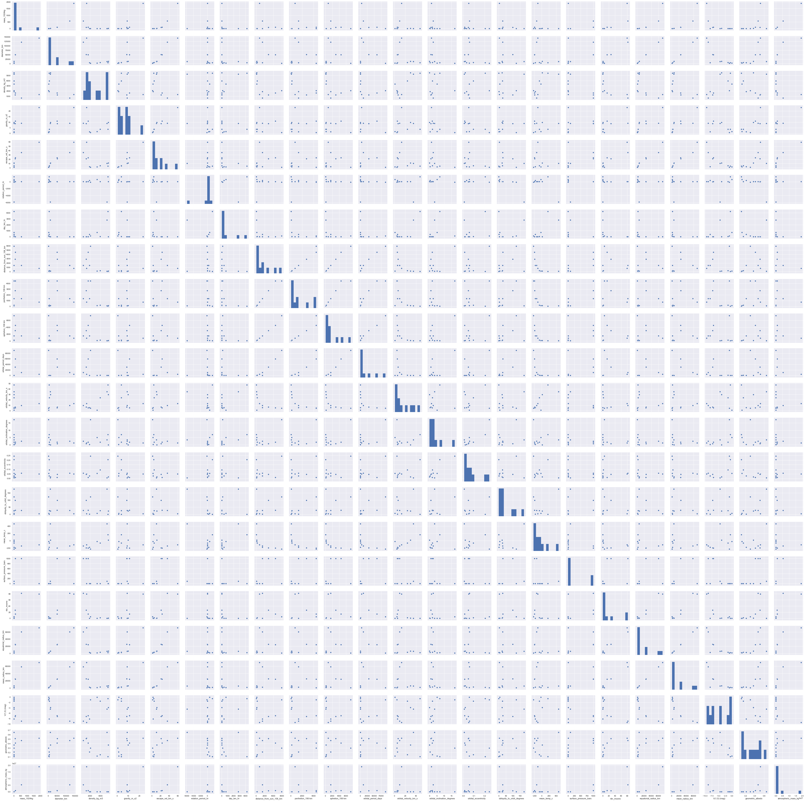


#### Narrow the feature list

By looking at the features, I can remove duplicates (diameter_km, equatorial_radius_km, and mean_readius_km are all nearly the same measure), discard features that are probably dependent on others (nbr_moons and rings are probably interrelated to the gravity of a planet), and eliminate irrevalent features (how bright a planet appears (V(1,0) (mag) and geometric_albedo) probably have nothing to do with the planet's ability to retain an atmosphere). Numerical features also tend to be more informative using pairplot than categorical features.

Using these kinds of rationals, I narrowed the feature set down to 8 features to explore: 'mass_1024kg' (the target variable), 'diameter_km', 'density_kg_m3', 'gravity_m_s2', 'distance_from_sun_106_km', 'mean_temp_c', 'surface_pressure_bars', 'magnetic_field', 'atmospheric_mass_kg'


```python
feature_list1 = ['mass_1024kg', 'diameter_km', 'density_kg_m3', 'gravity_m_s2', 'distance_from_sun_106_km', 'mean_temp_c', 'surface_pressure_bars', 'magnetic_field', 'atmospheric_mass_kg']
```


```python
sns.pairplot(planets[feature_list1])
```


    <seaborn.axisgrid.PairGrid at 0x1a2b076d50>


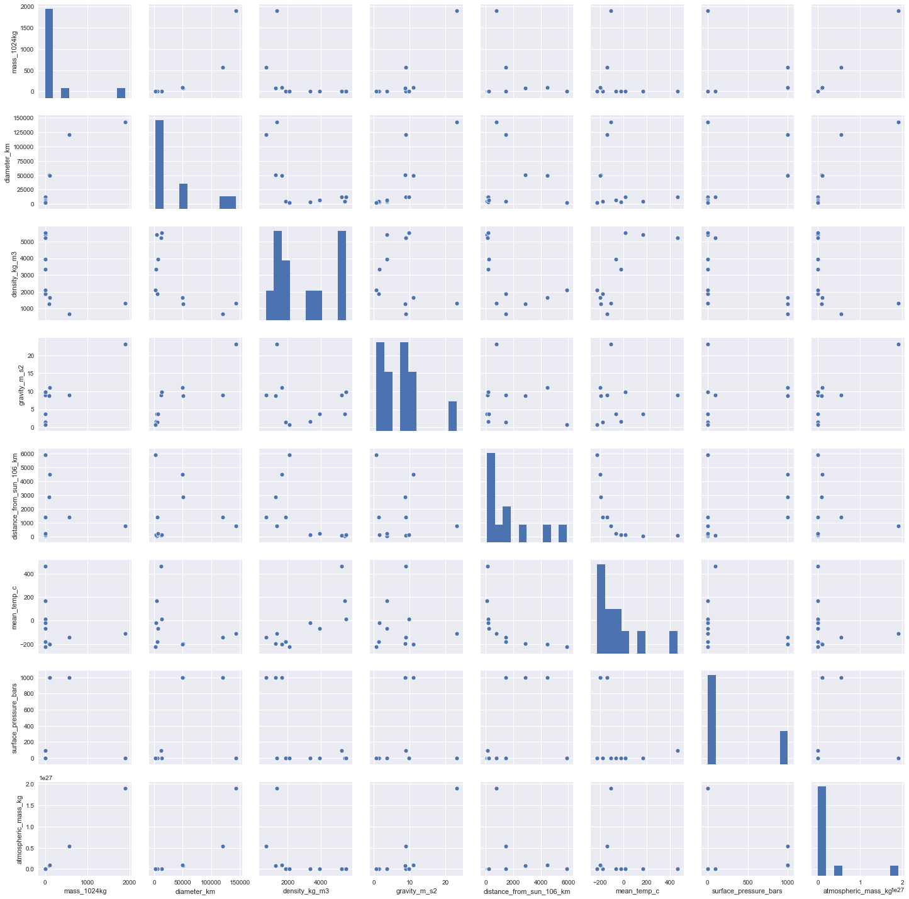


```python
sns.pairplot(planets[feature_list1], kind='reg', diag_kind='kde')
```


    <seaborn.axisgrid.PairGrid at 0x1a318838d0>


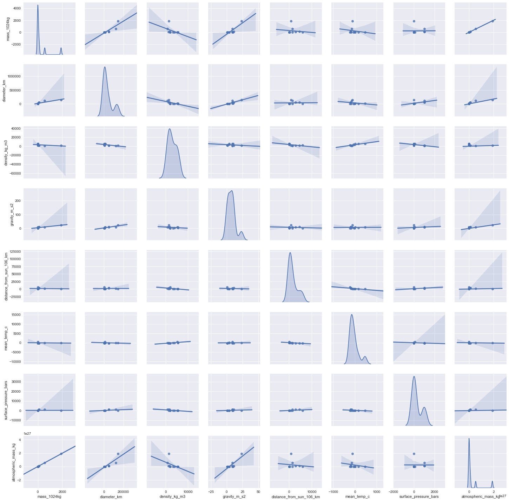


#### Test visualizations

Here I examine two features I know are mathematically related to make sure I can visualize them. Mass and diameter appear related by some kind of [power law](https://en.wikipedia.org/wiki/Power_law).

In the next graph, I put it on a log scale to better see how this power law works.

In the last of the series of three, I add gravity as a size parameter. As expected, as mass and diameter increase, so too does gravity.


```python
sns.relplot(x='mass_1024kg', y='diameter_km', data=planets, kind='scatter', height=6, aspect=1.8)
```


    <seaborn.axisgrid.FacetGrid at 0x1a33fc7c50>


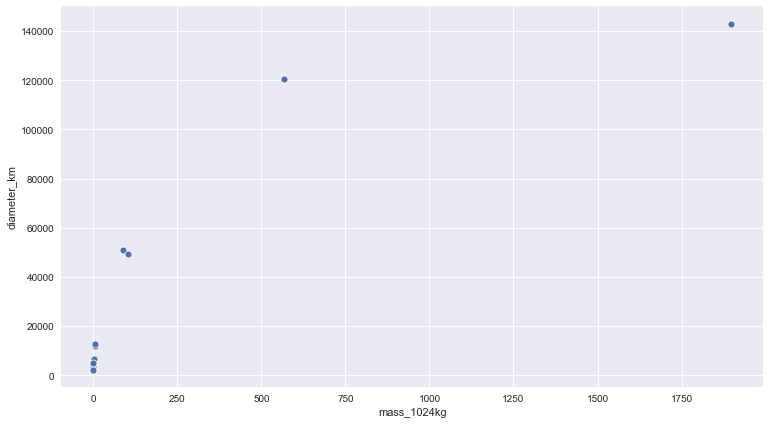


```python
l_plot = sns.relplot(x='mass_1024kg', y='diameter_km', data=planets, kind='scatter', height=6, aspect=1.8)
l_plot.set(xscale='log', yscale='log')
```


    <seaborn.axisgrid.FacetGrid at 0x1a341aff10>


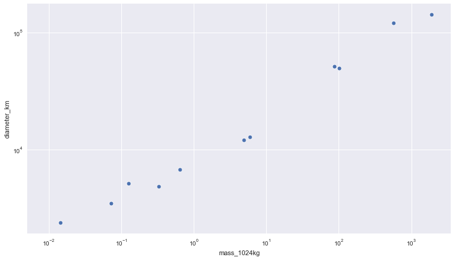


```python
l_plot = sns.relplot(x='mass_1024kg', y='diameter_km', data=planets, kind='scatter', height=8, aspect=1.6, size='gravity_m_s2')
l_plot.set(xscale='log', yscale='log')
```


    <seaborn.axisgrid.FacetGrid at 0x1a34ecd190>


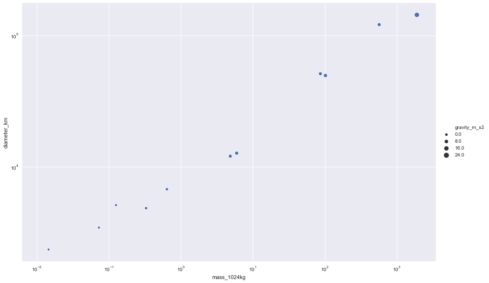


#### Examine how features relate to atmospheric mass

Next I wanted to explore how each of 5 features (surface_pressure_bars, gravity_m_s2, density_kg_m3, mass_1024kg, and diameter_km) related to atmospheric mass. These are the numeric features I expect to have the greatest impace on whether a planet can retain an atmosphere.

The first thing we need to see though, is how the planets are ordered when sorted by atmospheric mass. This will make it easier to interpret the findings in the graphs.


```python
planets[['atmospheric_mass_kg', 'surface_pressure_bars', 'gravity_m_s2', 'density_kg_m3', 'mass_1024kg', 'diameter_km']].sort_values('atmospheric_mass_kg', ascending=False)
```


<div>
<style scoped>
    .dataframe tbody tr th:only-of-type {
        vertical-align: middle;
    }

    .dataframe tbody tr th {
        vertical-align: top;
    }

    .dataframe thead th {
        text-align: right;
    }
</style>
<table border="1" class="dataframe">
  <thead>
    <tr style="text-align: right;">
      <th></th>
      <th>atmospheric_mass_kg</th>
      <th>surface_pressure_bars</th>
      <th>gravity_m_s2</th>
      <th>density_kg_m3</th>
      <th>mass_1024kg</th>
      <th>diameter_km</th>
    </tr>
    <tr>
      <th>name</th>
      <th></th>
      <th></th>
      <th></th>
      <th></th>
      <th></th>
      <th></th>
    </tr>
  </thead>
  <tbody>
    <tr>
      <th>Jupiter</th>
      <td>1.900000e+27</td>
      <td>2.000000e+00</td>
      <td>23.1</td>
      <td>1326</td>
      <td>1898.0000</td>
      <td>142984.0</td>
    </tr>
    <tr>
      <th>Saturn</th>
      <td>5.400000e+26</td>
      <td>1.000000e+03</td>
      <td>9.0</td>
      <td>687</td>
      <td>568.0000</td>
      <td>120536.0</td>
    </tr>
    <tr>
      <th>Neptune</th>
      <td>1.000000e+26</td>
      <td>1.000000e+03</td>
      <td>11.0</td>
      <td>1638</td>
      <td>102.0000</td>
      <td>49528.0</td>
    </tr>
    <tr>
      <th>Uranus</th>
      <td>8.600000e+25</td>
      <td>1.000000e+03</td>
      <td>8.7</td>
      <td>1271</td>
      <td>86.8000</td>
      <td>51118.0</td>
    </tr>
    <tr>
      <th>Earth</th>
      <td>1.400000e+21</td>
      <td>1.014000e+00</td>
      <td>9.8</td>
      <td>5514</td>
      <td>5.9700</td>
      <td>12756.0</td>
    </tr>
    <tr>
      <th>Venus</th>
      <td>4.800000e+20</td>
      <td>9.200000e+01</td>
      <td>8.9</td>
      <td>5243</td>
      <td>4.8700</td>
      <td>12104.0</td>
    </tr>
    <tr>
      <th>Titan</th>
      <td>9.100000e+18</td>
      <td>1.600000e+00</td>
      <td>1.4</td>
      <td>1882</td>
      <td>0.1260</td>
      <td>5149.4</td>
    </tr>
    <tr>
      <th>Mars</th>
      <td>2.500000e+16</td>
      <td>1.000000e-02</td>
      <td>3.7</td>
      <td>3933</td>
      <td>0.6420</td>
      <td>6792.0</td>
    </tr>
    <tr>
      <th>Pluto</th>
      <td>1.300000e+14</td>
      <td>1.000000e-05</td>
      <td>0.7</td>
      <td>2095</td>
      <td>0.0146</td>
      <td>2370.0</td>
    </tr>
    <tr>
      <th>Moon</th>
      <td>1.000000e+05</td>
      <td>3.000000e-15</td>
      <td>1.6</td>
      <td>3340</td>
      <td>0.0730</td>
      <td>3475.0</td>
    </tr>
    <tr>
      <th>Mercury</th>
      <td>1.000000e+03</td>
      <td>1.000000e-14</td>
      <td>3.7</td>
      <td>5427</td>
      <td>0.3300</td>
      <td>4879.0</td>
    </tr>
  </tbody>
</table>
</div>


```python
sns.lmplot(x='mass_1024kg', y='atmospheric_mass_kg', data=planets)
plt.figtext(.5, .0001, 'Planetary mass and atmospheric mass seem to be directly related', horizontalalignment='center', wrap=True, fontsize=16)
```


    Text(0.5, 0.0001, 'Planetary mass and atmospheric mass seem to be directly related')


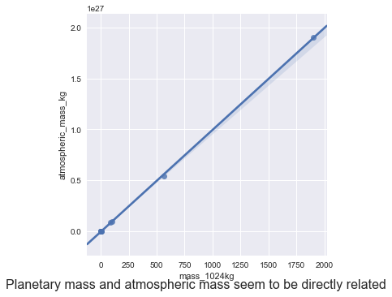


#### Surface pressure outlier

The large atmospheric mass with the low surface pressure is for Jupiter. A [quick internet search](https://en.wikipedia.org/wiki/Jupiter) turns up the reason for this: Jupiter has no solid surface and so the surface pressure is what marks the lower boundary of the atmosphere instead of the atmospheric pressure being measured at the surface.


```python
sns.relplot(x='surface_pressure_bars', y='atmospheric_mass_kg', data=planets, kind='scatter')
```


    <seaborn.axisgrid.FacetGrid at 0x1a35660bd0>


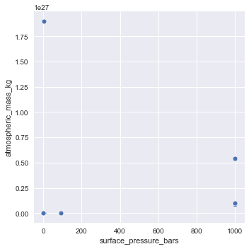


#### Gravity

Gravity seems to have two outliers: Jupiter and Saturn. However, the outlier status becomes more murky when the graph is put into log scale. In log scale, the two lowest values (Mercury and the Moon) appear to be the outliers.


```python
sns.relplot(x='gravity_m_s2', y='atmospheric_mass_kg', data=planets, kind='scatter')
```


    <seaborn.axisgrid.FacetGrid at 0x1a35b2f650>


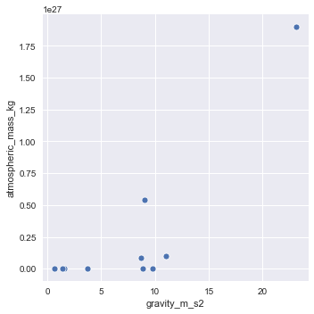


```python
l_plot = sns.relplot(x='gravity_m_s2', y='atmospheric_mass_kg', data=planets, kind='scatter')
l_plot.set(xscale='log', yscale='log')
```


    <seaborn.axisgrid.FacetGrid at 0x1a35cb0390>


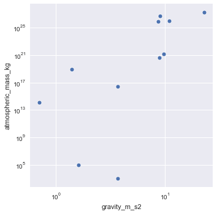


#### Density

This set of features are interesting. When the log scale is brought in, it appears as if there may be a third factor influencing any relationship between these two.


```python
sns.relplot(x='density_kg_m3', y='atmospheric_mass_kg', data=planets, kind='scatter')
```


    <seaborn.axisgrid.FacetGrid at 0x1a35f05c90>


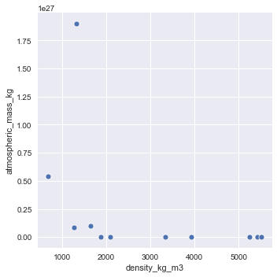


```python
l_plot = sns.relplot(x='density_kg_m3', y='atmospheric_mass_kg', data=planets, kind='scatter')
l_plot.set(xscale='log', yscale='log')
```


    <seaborn.axisgrid.FacetGrid at 0x1a36097c90>


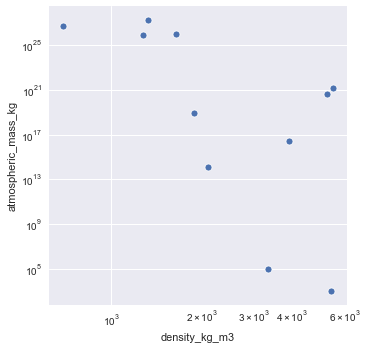


#### Misleading power law

The graph below showing diameter vs atmospheric mass appears to follow the same kind of power law as seen in the earlier graph of mass vs diameter. But as can be seen in the two graphs that follow the first, this association becomes less clear once we draw out the low end using log scale and can better see the relationships.


```python
sns.relplot(x='diameter_km', y='atmospheric_mass_kg', data=planets, kind='scatter')
```


    <seaborn.axisgrid.FacetGrid at 0x1a36288550>


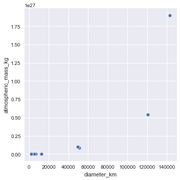


```python
l_plot = sns.relplot(x='atmospheric_mass_kg', y='diameter_km', data=planets, kind='scatter')
l_plot.set(xscale='log', yscale='log')
```


    <seaborn.axisgrid.FacetGrid at 0x1a362dbf90>


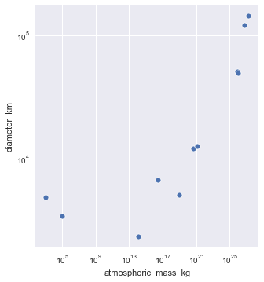


```python
l_plot = sns.relplot(x='atmospheric_mass_kg', y='diameter_km', data=planets, kind='scatter')
l_plot.set(xscale='log')
```


    <seaborn.axisgrid.FacetGrid at 0x1a36685f50>


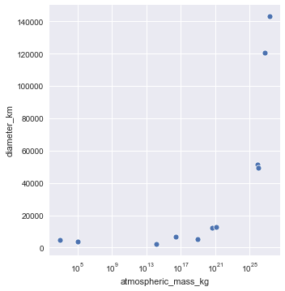


### Faceted plots

Plots that are broken out by a variable are called faceted or trellised. I used faceting to bring in some of the categorical variables.


```python
sns.lmplot(x='mass_1024kg', y='diameter_km', data=planets, hue='magnetic_field', col='type')
```


    <seaborn.axisgrid.FacetGrid at 0x1a36873d90>


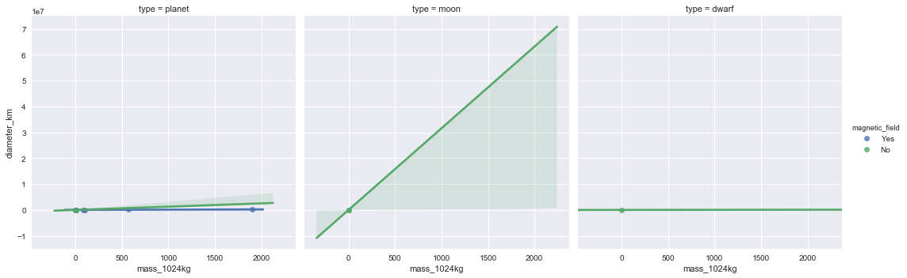


```python
sns.lmplot(x='mass_1024kg', y='diameter_km', data=planets, row='magnetic_field', col='type')
```


    <seaborn.axisgrid.FacetGrid at 0x1a36cf3d10>


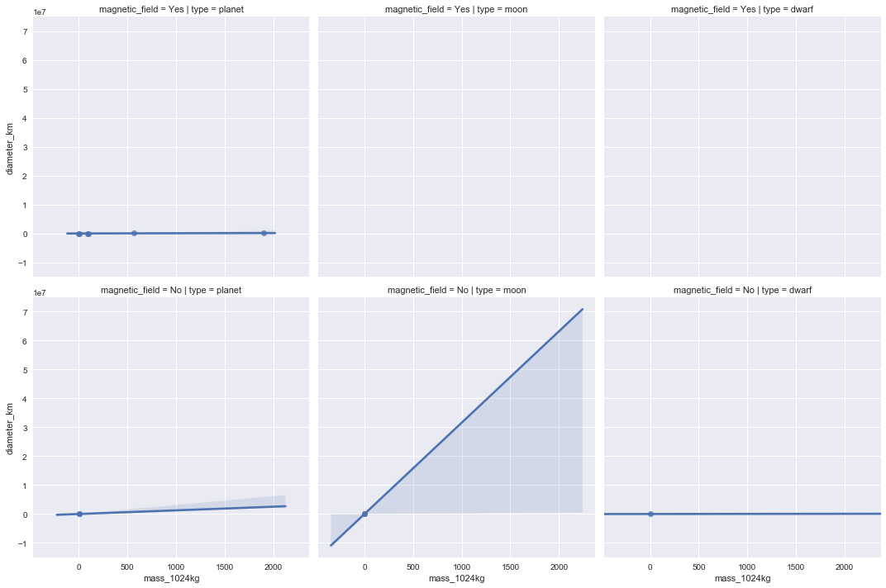


```python
planets['magnetic_field'].value_counts()
```


    Yes    6
    No     5
    Name: magnetic_field, dtype: int64


### Density plots

Historically, I haven't used these plots very often. However, while working on the Kaggle Data [Visualization course](https://www.kaggle.com/alexisbcook/distributions) I saw the power of this plot type. The 2D into 3D view this plot give of the data was able to separate out what looked like overlapping observations by showing sepal width and petal length.

The same kind of clarification can be seen in the second of the next two graphs.


```python
sns.jointplot(x='mass_1024kg', y='diameter_km', data=planets, kind='kde')
```


    <seaborn.axisgrid.JointGrid at 0x1a375b2490>


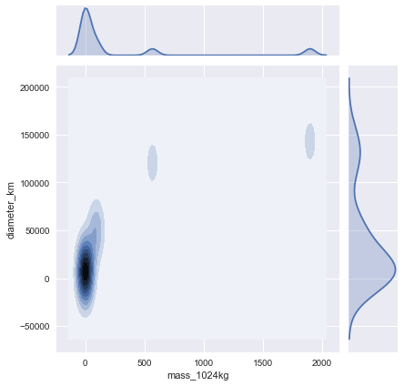


```python
sns.jointplot(x='density_kg_m3', y='gravity_m_s2', data=planets, kind='kde')
```


    <seaborn.axisgrid.JointGrid at 0x1a379bc9d0>


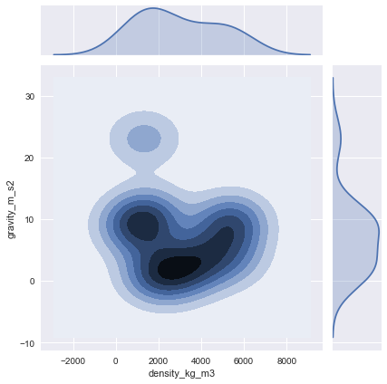


```python
sns.jointplot(x='density_kg_m3', y='gravity_m_s2', data=planets, kind='reg')
```


    <seaborn.axisgrid.JointGrid at 0x1a36680f90>


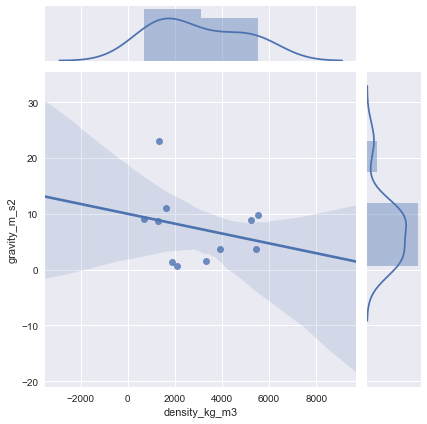


```python
sns.pairplot(planets, x_vars=['mass_1024kg', 'density_kg_m3'], y_vars=['gravity_m_s2', 'diameter_km'], height=5, kind='reg')
```


    <seaborn.axisgrid.PairGrid at 0x1a37c7a710>


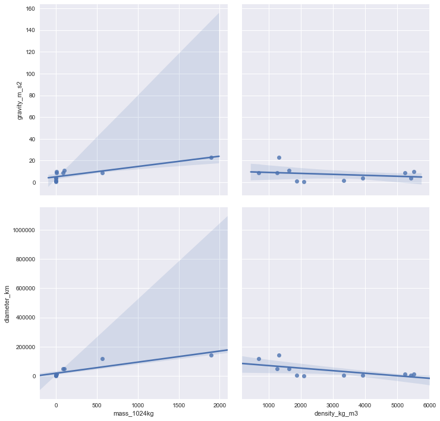


```python
sns.pairplot(planets, x_vars=['mass_1024kg', 'density_kg_m3'], y_vars=['gravity_m_s2', 'diameter_km'], height=5, kind='reg', hue='magnetic_field')
```


    <seaborn.axisgrid.PairGrid at 0x1a37e42b50>


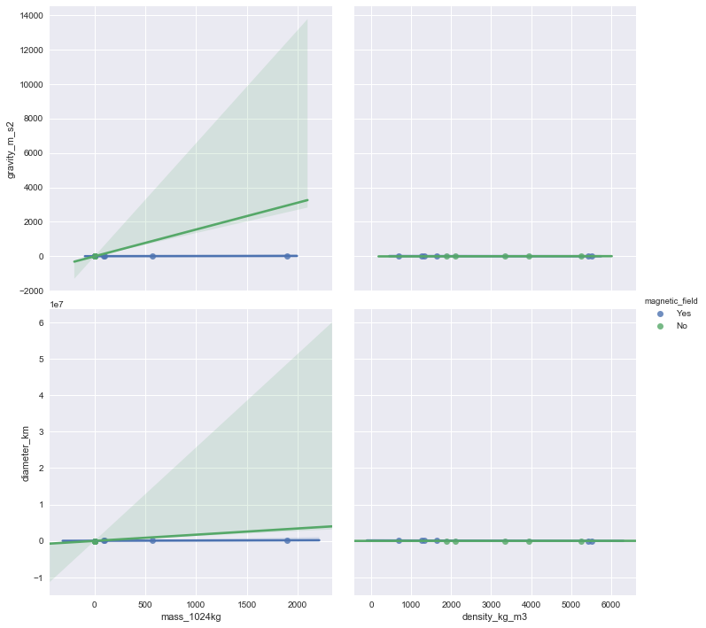

