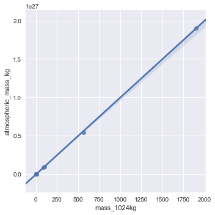
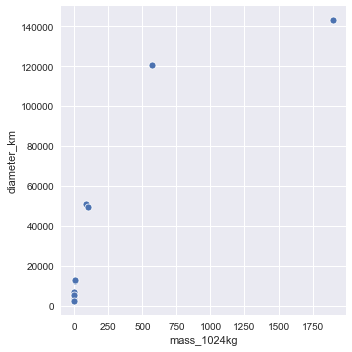

# Entry 6 - EDA with correlation

I need to find a way to automate some of the process outlined in [Entry 5](https://julielinx.github.io/blog/EDA/). My coworker [Sabber](https://medium.com/@sabber) suggested using correlation to help sort out the wheat from the chaff.

## The Problem

Many things can be learned using descriptive statistics and visualizations. However, it's a time consuming and manual process, which doesn't conform to the recommendations of Janson Brownlee of [machinelearningmastery.com](https://machinelearningmastery.com/) and Aurelien Geron of *[Hands-On Machine Learning with Scikit-Learn & TensorFlow](https://www.amazon.com/Hands-Machine-Learning-Scikit-Learn-TensorFlow/dp/1491962291)* to automate as much of the process as possible. 

## The Options

There are multiple ways to measure correlation. Each has it's strengths and weaknesses.

Sabber and I discussed three types of [correlation analysis](https://www.stat.cmu.edu/~ryantibs/datamining/lectures/11-cor2.pdf):
- [Pearson](https://www.spss-tutorials.com/pearson-correlation-coefficient/)
- [Spearman](https://en.wikipedia.org/wiki/Spearman%27s_rank_correlation_coefficient)
- [Maximal](http://proceedings.mlr.press/v32/nguyenc14.pdf)

### Pearson

This correlation measure is best at detecting linear relationships. It is generally considered the most common statistical measure (it certainly has the longest Wikipedia page of the three) and is generally the default method for most correlation functions.

This measure is best at finding linear relationships like the one between mass_1024kg and atmospheric_mass_kg.

### Spearman

This correlation measure uses rank order to determine correlation and can find non-linear as well as linear relationships.

This measure can find linear relationships like the one above between mass_1024kg and atmospheric_mass_kg, but it can also find power law type relationships like that between mass_1024kg and diameter_kg.

### Maximal

This is the most flexible of the correlation measures. Pearson and Spearman have difficulty with relationships such as circular and quadratic. Some of the limitations of Pearson can be seen in the following image (1 is a perfect positive relationship, 0 is no relationship, and -1 is a perfect negative relationship):

Maximal correlation is designed to characterize independence completely, which would find the relationships left on the table by Pearson and Spearman. I didn't dive too deep into this measure, but there seem to be different versions of it. Sabber and I discussed ACE (alternating conditional expectations), but the Wikipedia article referenced above discussed a MAC (maximal multivariate correlation analysis - don't ask me how they came up with their acronym, I have no idea) version.

## The Proposed Solution

Maximal correlation seems like the obvious solution: it finds the same relationships as the other two as well as relationships the others miss. Unfortunately, there isn't a ready made implementation of this measure. In the spirit of 'each mini-project should take 1-2 hours including the write-up' I'm taking Maximal off the table. That said, being the curious bugger I am, I'd like to see how Pearson and Spearman compare.

In Python, the only difference between using the Pearson and Spearman methods is whether the 'method' parameter is left blank or is set equal to Spearman for either the corr() or corrwith() functions. As such, I ran both and compared the results. They're pretty similar, but Spearman does appear to provide a better measure of importance in the majority of cases. The code for my little experiment can be found in the [Entry 6 notebook](https://github.com/julielinx/datascience_diaries/blob/master/01_ml_process/06_nb_EDA_corr.ipynb).

## The Fail

I'm not entirely comfortable leaving off visualization completely. It feels like something that will come back and bite me later. Both the automated/mathematical and the manual/visualization methods have drawbacks.

There is a finite amount of time a person can realistically devote to exploring data by hand with visualizations. People are also more likely to concentrate on features they think are more important. For example, I didn't look at day length or number of moons at all in my manual analysis. These features may be a proxy for mass (the larger planets are farther out with longer days, and large planets tend to capture more moons), but they may be just different enough that it may be easier for a model to use than a more human interpretable 'common sense' feature.

The best course of action while refining my process is to keep in mind the pros and cons of both manual and mathematical methods. Hopefully, a solution will evolve naturally as I apply it to a variety of datasets.

The process as it stands has helped me develop a more reasonable list of features that are related to my target variable. However, this hasn't addressed how the features are related to each other. If I remember correctly from that statistics class during my graduate work, collinearity (prediction features being correlated) can mess up predictions.

## Next Up

Reviewing collinearity.

### Resources

- [machinelearningmastery.com](https://machinelearningmastery.com/)
- [Hands-On Machine Learning with Scikit-Learn & TensorFlow](https://www.amazon.com/Hands-Machine-Learning-Scikit-Learn-TensorFlow/dp/1491962291)
- [Carnegie Mellon Univeristy Data Mining course notes](https://www.stat.cmu.edu/~ryantibs/datamining/)
- [Multivariate Maximal Correlation Analysis paper](http://proceedings.mlr.press/v32/nguyenc14.pdf)
